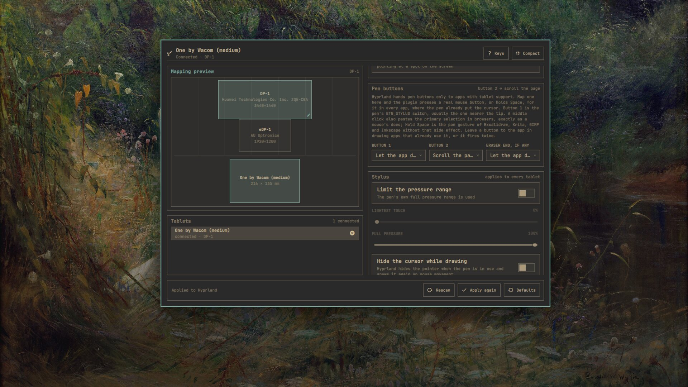
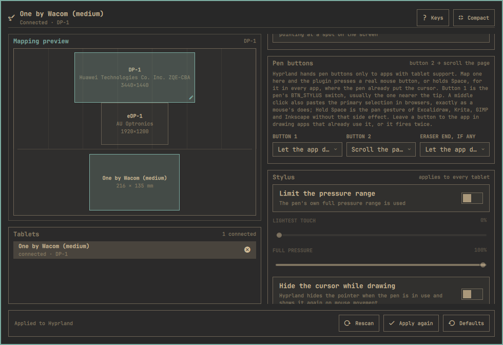

<h1 align="center">Drawing Tablet for Omarchy</h1>

<p align="center">
  Map a pen tablet to the right screen from the bar and keep it there across hotplug and Hyprland reloads, built from Omarchy's own panel components.
</p>

<p align="center">
  <a href="https://github.com/alxcrt/omarchy-drawing-tablet/tags"></a>
</p>

<p align="center">
  
</p>

Works with any tablet libinput sees as a tablet: every Wacom, and the Huion, XP-Pen, Gaomon and Ugee models with kernel support. Pick the target screen, keep the tablet's proportions or draw a custom region, flip it for a left-handed grip (or rotate a display tablet), switch between pen and mouse mode, limit the pen's pressure range, and hide the cursor while you draw. A small background service re-applies the mapping on hotplug and after every Hyprland reload.

## The mapping follows the tablet, not the port

Profiles are matched by the tablet's make, model and serial, read from udev, so moving the cable to another USB port or plugging the tablet into a dock does not lose your mapping. Screens are referenced by their EDID description, so a monitor that shows up as `DP-1` today and `HDMI-A-1` tomorrow still gets the tablet.

Hyprland forgets runtime input settings whenever its configuration reloads. The service watches for that (`configreloaded`), for udev input hotplug, and for monitor changes, and pushes the saved profile again within a second. Nothing is written into `~/.config/hypr`, so `omarchy refresh hyprland` cannot break it and removing the plugin leaves no trace behind.

## What it does

**Compact panel**

- Map to: all screens, the focused screen, or one particular screen
- Screen area: fill the screen, keep the tablet's proportions (largest undistorted box, centred), or a custom region
- Tablet area: the whole tablet, a crop that matches the screen's proportions (one pen millimetre is the same distance on screen in both directions), or a custom area in millimetres
- Left-handed mode (a 180° flip), rotation on display tablets, and mouse mode, per tablet
- A preview of the screens with the mapped region and the tablet with its active area

**Expanded editor**

- Drag the custom region on the preview, or nudge it with `Shift` + arrows and resize it with `Ctrl` + arrows
- Custom region in percent of the screen and custom active area in millimetres
- What the kernel and libwacom know about the tablet: model, vendor, size, pen capabilities, pad buttons, which rotations libinput allows, Hyprland's name for it
- Pen buttons: turn button 1, button 2 and the eraser end into real left, middle or right clicks that work in every app, or leave them to the app
- Stylus settings, which Hyprland applies to every tablet: clip the pressure range, make a pen's eraser button send a pen button instead, and hide the cursor while the pen is in use
- Every remembered tablet, connected or not, with a way to forget one

**Keyboard**

- `↑ ↓` move between controls, `← →` change the highlighted option, `Enter` opens a menu or flips a switch
- `e` expands or collapses, `r` rescans tablets and screens, `a` applies again, `d` resets the tablet to Hyprland's defaults, `?` shows the keys

Changes apply and save as you make them. There is no separate apply step: a tablet mapping is harmless to get wrong and instant to change back.

## Screenshots

The compact panel is the everyday view; **Expand** opens the editor.



## Install

```sh
omarchy plugin add https://github.com/alxcrt/omarchy-drawing-tablet.git --enable
```

Nothing else to install: the panel talks to Hyprland through `hyprctl eval`, reads the tablet's identity from udev, and uses libwacom's database (which ships with libinput) for the model name and pen capabilities.

## Requirements

- Omarchy with third-party shell plugins
- Hyprland 0.55 or newer, which configures input devices in Lua (`hyprctl eval` is how the mapping is applied)
- A tablet that libinput sees as a tablet

## Which tablets

The plugin works with any tablet Hyprland works with, and Hyprland works with any tablet libinput recognises. In practice:

- **Wacom**: every model with a kernel driver, which is all of them since the in-kernel `wacom` driver also handles unknown Wacom pens generically. USB, Bluetooth and laptop-integrated (I²C) digitizers alike.
- **Huion, Gaomon, XP-Pen, Ugee**: the older models handled by the kernel's `hid-uclogic` driver work out of the box. Newer models are supported through HID-BPF programs that the kernel ships but does not load itself — install the `udev-hid-bpf` package from the Arch repositories and replug. Without it the pen still works as a generic HID pen; only the pad buttons come through as keyboard keys.
- **OpenTabletDriver** users: its "Artist mode" virtual tablet is a proper libinput tablet, so the panel maps and rotates it like any other (its "Absolute mode" is a mouse, not a tablet).
- **Veikk** has no upstream driver; use OpenTabletDriver.

Multiple tablets can be connected at once; each gets its own profile. A tablet libwacom does not know still works — the panel then shows the kernel's name for it and, following libinput, allows rotation and the left-handed flip.

## Pen buttons and pad keys

Hyprland forwards the pen's side buttons and the eraser to the application under the pen through the Wayland tablet protocol, without remapping. In applications with tablet support (Krita, GIMP, Inkscape, Blender, Xournal++, GTK and Qt apps in general, Chromium since mid-2025) the first button is a middle click and the second a right click unless the app assigns them itself. Applications without tablet support only see the pointer move: the pen cannot click in them, which is a Hyprland limitation ([discussion #6226](https://github.com/hyprwm/Hyprland/discussions/6226)).

The **Pen buttons** pane in the expanded editor gets around that for the buttons: map button 1, button 2 or the eraser end to a left, middle or right click, to holding Space, or to **scrolling the page** (hold the button and move the pen — the hand-tool pan that works in browsers, PDF viewers and editors alike), and the background service runs a small helper (`tools/pen-buttons.py`, standard-library Python) that reads the pen's evdev node without taking it away from libinput and presses that button on a virtual pointer (or holds the key on a virtual keyboard), where the pen already put the cursor. It works in every app, including ones without tablet support. Apps that already use the buttons would get them twice, so the default is "let the app decide". Button 1 is the pen's `BTN_STYLUS` switch, usually the one nearer the tip; button 2 is `BTN_STYLUS2`.

Three things worth knowing before you map. A right click is only sent while the pen is over an application window: on Qt 6.11 the Omarchy shell crashes when a right click reaches one of its own surfaces (the wallpaper, the bar, a panel), so the helper checks with `hyprctl` first and skips the click there ([quickshell #900](https://github.com/quickshell-mirror/quickshell/issues/900)). A middle click from the virtual mouse is a middle click, so in browsers it also pastes the primary selection, exactly as a mouse's middle button does; **Hold Space** is the pan gesture of Excalidraw, Krita, GIMP, Inkscape and most other drawing apps without that side effect. **Scroll the page** is the one to use for reading and browsing the web: hold the button and drag the pen up to move down the page, like a touchscreen. And the eraser row only appears when the tablet can report an eraser tool: libwacom knows the pens of most Wacom models, but for a pen it has no data on (it then lists only its generic "General Pen") the Tablet pane shows what the tablet accepts, which can be more than the pen in the box has, so the row is labelled "eraser end, if any".

The virtual pointer and keyboard are Wayland objects Hyprland offers to every client (`zwlr_virtual_pointer_v1`, `zwp_virtual_keyboard_v1`), the same ones `wtype` uses. No sudo or pkexec is required, and nothing is installed or written outside the plugin's own profile file.

Pad buttons, rings and strips are forwarded the same way and Hyprland has no way to bind them; [input-remapper](https://github.com/sezanzeb/input-remapper) can turn them into key presses at the evdev level for now. The Tablet pane lists what your pen and pad have.

## Rotation is a libinput decision

Hyprland rotates a tablet by handing libinput a calibration matrix, and libinput only accepts one for tablets that are built into a screen (`INPUT_PROP_DIRECT`, or `IntegratedIn` in libwacom's database). On an external tablet the request is silently ignored, so the only rotation such a tablet can do is the 180° flip that libinput implements as *left-handed* — and only when libwacom marks the model `Reversible`. The panel reads the same database libinput does and shows only the controls that will actually do something: display tablets get the full rotation menu, external ones get the Left-handed switch, and the Tablet pane says which case yours is.

There is no switch to turn a tablet off: Hyprland ignores `enabled` for tablets ([PR #14158](https://github.com/hyprwm/Hyprland/pull/14158) is still open), and a switch that does nothing would be worse than none.

## How the mapping is computed

Hyprland maps a tablet with `output`, `region_position`/`region_size` in logical pixels relative to that output, and `active_area_position`/`active_area_size` in millimetres of the tablet surface. The profile stores intent rather than pixels — "keep the tablet's proportions on DP-1" — and the numbers are computed from the live monitor layout every time the profile is applied, so a resolution or scale change never stales a mapping.

The profile lives in `~/.config/omarchy-drawing-tablet/tablets.json`. Device names and monitor descriptions come from USB and EDID descriptors and are passed to Hyprland only as quoted Lua string data, never as code; a name carrying control characters is refused.

## Staying up to date

Omarchy installs plugins as git checkouts and never pulls them, so this one checks for itself. When the checkout is behind its origin, the panel offers **Update this panel**, which runs `omarchy plugin update io.github.alxcrt.drawing-tablet` and restarts the Omarchy shell. The check happens when you open the panel, at most once every few hours, and stays quiet when the checkout has no remote or the remote cannot be reached.

## Settings

One bar setting, editable from Omarchy's bar settings or the command line:

```sh
omarchy bar set io.github.alxcrt.drawing-tablet hideWhenDisconnected true --json
```

hides the icon while no tablet is plugged in (it comes back on its own).

## Remove

```sh
omarchy plugin remove io.github.alxcrt.drawing-tablet
```

The tablet goes back to Hyprland's defaults on the next reload. Your profiles remain in `~/.config/omarchy-drawing-tablet/tablets.json`.

## Development

```sh
omarchy plugin validate .
node --test tests/model.test.js
```

`Model.js` holds every decision — device discovery, identity, geometry, the Lua that gets sent — as pure functions, so the whole apply plan is unit-tested without a compositor. The QML is a thin shell around it: `TabletEngine.qml` runs the probe, reads and writes the profile, and calls `hyprctl`; `Panel.qml` is the bar panel; `Service.qml` is the background re-applier.

## Contributing

Read [CONTRIBUTING.md](CONTRIBUTING.md) first; it says what review will ask for. The measured facts the code relies on live in [`knowledge/`](knowledge/index.md), one file per fact, so a claim about Hyprland or libinput can be checked before it is argued about. Coding agents get their own notes in [AGENTS.md](AGENTS.md).

## Licence

[MIT](LICENSE).
