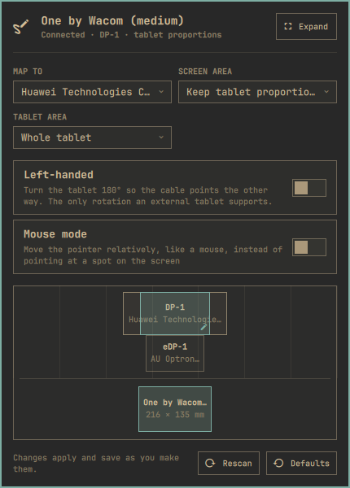

<h1 align="center">Drawing Tablet for Omarchy</h1>

<p align="center">
  Map a pen tablet to the right screen from the bar and keep it there across hotplug and Hyprland reloads, drawn in Omarchy's own panel idiom.
</p>

<p align="center">
  <a href="https://github.com/alxcrt/omarchy-tablet/tags"></a>
</p>

<p align="center">
  
</p>

Works with any tablet libinput sees as a tablet: every Wacom, and the Huion, XP-Pen, Gaomon and Ugee models with kernel support. Pick the target screen, keep the tablet's proportions or draw a custom region, rotate it, flip it for a left-handed grip, switch between pen and mouse mode, and limit the pen's pressure range. A small background service re-applies the mapping on hotplug and after every Hyprland reload.

It is the tablet sibling of [hyprmoncfg for Omarchy](https://github.com/crmne/omarchy-hyprmoncfg): the same compact panel with the everyday controls, the same expanded editor with a visual preview, the same keyboard-first navigation.

## The mapping follows the tablet, not the port

Profiles are matched by the tablet's make, model and serial, read from udev, so moving the cable to another USB port or plugging the tablet into a dock does not lose your mapping. Screens are referenced by their EDID description, so a monitor that shows up as `DP-1` today and `HDMI-A-1` tomorrow still gets the tablet.

Hyprland forgets runtime input settings whenever its configuration reloads. The service watches for that (`configreloaded`), for udev input hotplug, and for monitor changes, and pushes the saved profile again within a second. Nothing is written into `~/.config/hypr`, so `omarchy refresh hyprland` cannot break it and removing the plugin leaves no trace behind.

## What it does

**Compact panel**

- Map to: all screens, the focused screen, or one particular screen
- Screen area: fill the screen, keep the tablet's proportions (largest undistorted box, centred), or a custom region
- Tablet area: the whole tablet, a crop that matches the screen's proportions (one pen millimetre is the same distance on screen in both directions), or a custom area in millimetres
- Left-handed mode (a 180° flip), rotation on display tablets, mouse mode, and a pen-input switch per tablet
- A preview of the screens with the mapped region and the tablet with its active area

**Expanded editor**

- Drag the custom region on the preview, or nudge it with `Shift` + arrows and resize it with `Ctrl` + arrows
- Custom region in percent of the screen and custom active area in millimetres
- What the kernel and libwacom know about the tablet: model, vendor, size, pen capabilities, pad buttons, which rotations libinput allows, Hyprland's name for it
- Stylus settings, which Hyprland applies to every tablet: clip the pressure range, and turn the eraser end into a button
- Every remembered tablet, connected or not, with a way to forget one

**Keyboard**

- `↑ ↓` move between controls, `← →` change the highlighted option, `Enter` opens a menu or flips a switch
- `e` expands or collapses, `r` rescans tablets and screens, `a` applies again, `d` resets the tablet to Hyprland's defaults, `?` shows the keys

Changes apply and save as you make them; there is no separate apply step, because a wrong tablet mapping cannot strand you the way a wrong monitor layout can.

## Install

```sh
omarchy plugin add https://github.com/alxcrt/omarchy-tablet.git --enable
```

Nothing else to install: the panel talks to Hyprland through `hyprctl eval`, reads the tablet's identity from udev, and uses libwacom's database (which ships with libinput) for the model name and pen capabilities.

## Requirements

- Omarchy with third-party shell plugins
- Hyprland 0.55 or newer, which configures input devices in Lua (`hyprctl eval` is how the mapping is applied)
- A tablet that libinput sees as a tablet

## Rotation is a libinput decision

Hyprland rotates a tablet by handing libinput a calibration matrix, and libinput only accepts one for tablets that are built into a screen (`INPUT_PROP_DIRECT`, or `IntegratedIn` in libwacom's database). On an external tablet the request is silently ignored, so the only rotation such a tablet can do is the 180° flip that libinput implements as *left-handed* — and only when libwacom marks the model `Reversible`. The panel reads the same database libinput does and shows only the controls that will actually do something: display tablets get the full rotation menu, external ones get the Left-handed switch, and the Tablet pane says which case yours is.

Pen side buttons and the eraser end are passed straight to the application under the pen (Krita, GIMP, Inkscape, Blender and friends decide what they do), exactly as Hyprland delivers them; the panel does not remap them. Tablet pad buttons (express keys) are not managed here either, since Hyprland has no per-pad binding surface yet.

## How the mapping is computed

Hyprland maps a tablet with `output`, `region_position`/`region_size` in logical pixels relative to that output, and `active_area_position`/`active_area_size` in millimetres of the tablet surface. The profile stores intent rather than pixels — "keep the tablet's proportions on DP-1" — and the numbers are computed from the live monitor layout every time the profile is applied, so a resolution or scale change never stales a mapping.

The profile lives in `~/.config/omarchy-tablet/tablets.json`. Device names and monitor descriptions come from USB and EDID descriptors and are passed to Hyprland only as quoted Lua string data, never as code; a name carrying control characters is refused.

## Staying up to date

Omarchy installs plugins as git checkouts and never pulls them, so this one checks for itself. When the checkout is behind its origin, the panel offers **Update this panel**, which runs `omarchy plugin update io.github.alxcrt.tablet` and restarts the Omarchy shell. The check happens when you open the panel, at most once every few hours, and stays quiet when the checkout has no remote or the remote cannot be reached.

## Remove

```sh
omarchy plugin remove io.github.alxcrt.tablet
```

The tablet goes back to Hyprland's defaults on the next reload. Your profiles remain in `~/.config/omarchy-tablet/tablets.json`.

## Development

```sh
omarchy plugin validate .
node --test tests/model.test.js
```

`Model.js` holds every decision — device discovery, identity, geometry, the Lua that gets sent — as pure functions, so the whole apply plan is unit-tested without a compositor. The QML is a thin shell around it: `TabletEngine.qml` runs the probe, reads and writes the profile, and calls `hyprctl`; `Panel.qml` is the bar panel; `Service.qml` is the background re-applier.
